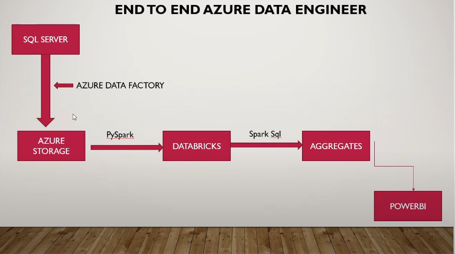
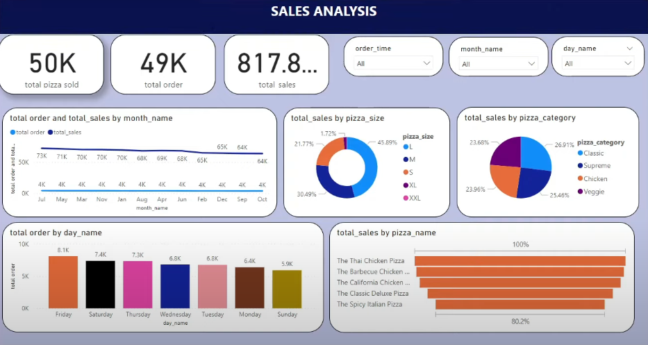

# Data Migration and Pizza Sales Analytics Dashboard with Azure Services

## Overview
This project focuses on building a comprehensive solution for migrating data from an on-premises SQL Server database to the Azure cloud. The solution leverages multiple Azure services, including Azure Data Factory, Azure Data Lake, Azure Databricks, and Microsoft Power BI, to enable efficient data migration, transformation, and visualization. The goal is to not only migrate data seamlessly but also to provide business users with insights through an interactive dashboard.

## Architecture

## PowerBI Report

## Project Goals
1.	Data Migration:
Efficiently move data from on-premises SQL Server to Azure Cloud.
2.	Data Storage:
Store raw data in Azure Data Lake for future access and transformation.
3.	Data Transformation:
Utilize Azure Databricks to clean and transform raw data into an optimized, clean format for analytics.
4.	Data Visualization:
Use Microsoft Power BI integrated with Azure Synapse Analytics to build a dynamic and interactive dashboard to display key performance indicators (KPIs) and analytics.
5.	Automation:
Automate the data ingestion process to ensure ongoing, seamless data migration and updates from the on-prem SQL server to the Azure platform.

## Services and Tools Used:
1.	Azure Data Factory (ADF): Used for orchestrating data migration pipelines from on-prem SQL Server to Azure Data Lake.
2.	Azure Data Lake: Used for storing raw and processed data in a scalable and secure cloud environment.
3.	Azure Databricks: Used for data transformation, including cleaning, aggregating, and structuring the data into its final form for analysis.
4.	Azure Synapse Analytics: Provides an analytics workspace where transformed data is stored and queried for reporting and dashboarding purposes.
5.	Microsoft Power BI: Integrated with Azure Synapse Analytics to build and visualize an interactive dashboard that provides business insights.

## Dataset Used ( Pizza Sales ) 
•	Source Dataset:
The dataset originates from an on-premises SQL Server database containing tables related to pizza sales, including information about orders, customers, products, and sales.
•	Target Dataset:
Once the data is ingested to Azure Data Lake and transformed in Azure Databricks, it is stored in Azure Synapse Analytics for reporting and visualization purposes.

Here is the dataset used - https://github.com/bharathv-de/sales-de-migration-project-azure/blob/main/pizza_sales.csv

## Challenges: 
•	Optimizing Data Pipeline Performance:
Migrating large amounts of data from the on-prem SQL Server to Azure Data Lake using Azure Data Factory required me to optimize the data pipelines for better performance. I had to address issues like network latency, manage parallel data processing, and control costs, all while ensuring the data transfer was smooth and efficient.
•	Data Transformation and Cleansing in Azure Databricks:
After migrating the data, transforming and cleaning it in Azure Databricks posed challenges due to inconsistencies and missing values. Writing efficient Spark-based transformations and handling schema changes were crucial to ensure the data was clean, accurate, and ready for analysis.

## Conclusion:
This project successfully achieved the goal of migrating data from an on-premises SQL Server to the Azure cloud, transforming the data into clean and usable formats, and building a comprehensive Power BI dashboard for interactive data visualization. The integration of Azure services such as Data Factory, Data Lake, Databricks, and Synapse Analytics provided an end-to-end solution that can be extended for future use cases. The ability to automate data ingestion and transformation workflows significantly improves operational efficiency, and the resulting Power BI dashboard allows stakeholders to make data-driven decisions based on real-time insights.

